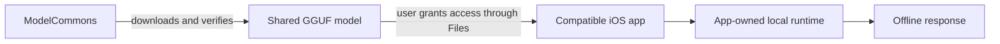

# ModelCommons

**Download once in ModelCommons. Use the model locally from another compatible app.**

ModelCommons is an experimental mobile-first project from Uva Solutions for
sharing on-device AI models across applications. It combines a model hub, a
provider-neutral protocol, storage connectors, and optional local runtimes.

**Pre-alpha / developer preview.** A working iOS shared-model flow has been
verified by the project owner on a physical iPhone SE, offline. APIs and the
protocol may change; this is not a production-ready release or a promise of
compatibility with every app, model, or device.

## The verified milestone

The owner tested ModelCommons with **Sales & Pricing Mobile**:

1. Deleted the consumer app's private local model.
2. Downloaded the model only in ModelCommons.
3. Connected through the iOS **Files folder picker** and selected
   **Shared with ModelCommons** in Sales & Pricing Mobile.
4. Generated a real response in airplane mode. The displayed provider was
   **`LOCAL_MODELCOMMONS`**.

ModelCommons owns the shared model storage. Sales & Pricing Mobile reads that
model and runs inference in its own process, without a second model download
in the reported test.

Read the [iOS verification record](docs/verification/ios-shared-models.md) for the
reported steps, timings, evidence limits, and reproduction procedure. The exact
model, iOS version, app build numbers, and screenshots are not yet recorded.
This is one owner-verified device scenario, not a device compatibility matrix.

## How sharing works



The iOS flow reuses the model **file**. Each consuming app still ships a runtime
and allocates its own inference context and memory. ModelCommons is not an iOS
background inference server. A compatible app must integrate the client and
storage connector; existing apps do not gain sharing automatically.

| Path | Status |
| --- | --- |
| iOS Files sharing | Owner-verified offline generation on iPhone SE with Sales & Pricing Mobile |
| Local inference inside each app | Reported working by the owner; the shared test is documented separately |
| iOS App Groups | Optional same-team storage path implemented; separate device verification pending |
| Separately signed, unrelated-team iOS clients | Not yet device-verified |
| Android centralized inference over Binder | Implemented; native CPU library compiles and links; two-app device verification pending |
| Canonical client, model store, runtime and provider adapters | Implemented and covered by local contract tests; supported subsets vary |
| npm distribution | Local package build/packing available; no public npm release claimed |
| Web | Protocol/client code is reusable; native inference reports unavailable |

Android is the next platform milestone. It is designed to let the Hub own both
storage and inference, with authorized clients calling a Binder service. Its
[acceptance procedure](docs/verification/android-binder-inference-owner-run.md)
tracks the remaining device work.

## Start here

- [Try ModelCommons with a compatible app](QUICKSTART.md)
- [Build the Hub and integrate a client](docs/getting-started.md)
- [iOS device evidence and reproduction](docs/verification/ios-shared-models.md)
- [Platform contracts and implementation status](docs/README.md)
- [Sales & Pricing integration](docs/integrations/sales-and-pricing.md)
- [Roadmap](docs/ROADMAP.md)

The Hub uses Expo SDK 54, React Native 0.81.5, and exact `llama.rn` 0.12.9.
Use Node.js 22 for the documented development workflow (the manifest minimum is
20.19.0), npm, and the relevant native platform tools.

```sh
npm ci
npm run lint
npm run typecheck
npm test
```

The committed `package-lock.json` locks the workspace. Native dependency install
hooks may download checksum-verified **engine binaries**, never model weights.
Expo Go cannot load these custom native modules; use a native development build
or a signed EAS build. The [getting-started guide](docs/getting-started.md) explains
fork-specific Expo project IDs and signing configuration.

## Client API

Applications supply the transport for the explicitly selected local mode:

```ts
import { ModelCommons } from '@modelcommons/client';

const client = await ModelCommons.connect({ transport });
const session = await client.createSession({ capabilities: ['text'] });

try {
  const response = await session.generate({
    messages: [
      { role: 'user', content: [{ type: 'text', text: 'Summarize this locally.' }] },
    ],
    maxOutputTokens: 128,
  });
  // The application validates and presents the canonical response.
} finally {
  await session.release();
}
```

`transport` is application-owned composition, not a global discovery service.
See [reference clients](examples/reference-client/README.md) and the
[iOS connector contract](docs/platforms/ios.md) for complete boundaries.

Optional OpenAI-shaped and Anthropic-shaped fetch adapters translate a documented
subset into canonical requests. They do not contact those providers and do not
provide their models. Official SDK acceptance on React Native remains pending.
The current llama.rn stream supplies usage at completion, so **Anthropic streaming
fails explicitly until a backend supplies input-token usage before content**.
See the [compatibility matrix](docs/providers/compatibility.md).

## Privacy and model ownership

- Local modes have no hidden cloud fallback.
- Hub chat content stays in memory; diagnostics use a metadata allowlist.
- Generated output is inert text. Applications own any tool execution and output
  validation.
- The user chooses model downloads, accepts the applicable model license, and
  grants access to compatible clients.
- The iOS shared reader uses scoped, coordinated reads. Coordination does not
  protect against every noncooperative writer; lifecycle and security testing
  remain in progress.

Model weights are downloaded separately and are **not** covered by the software's
MIT license. The catalog includes small checksum-pinned GGUF models for local
smoke tests, with upstream sources and license information. Catalog inclusion
is not a performance or quality guarantee.

The optional **Report output** flow previews a selected response and sends it to
an operator-configured receiver only after explicit confirmation. It is separate
from inference. Community builds work without a receiver; there is no fallback
reporting endpoint. See [PRIVACY.md](PRIVACY.md),
[SECURITY.md](SECURITY.md), and the [threat model](docs/security/threat-model.md).

## Repository map

| Location | Purpose |
| --- | --- |
| [`packages/protocol`](packages/protocol) | Dependency-free types, errors and validation |
| [`packages/client`](packages/client) | Selection, configuration, sessions and transport contracts |
| [`packages/model-store`](packages/model-store) | Generic model registry, storage and integrity policy |
| [`packages/embedded`](packages/embedded) | Private/shared-store local inference composition |
| [`packages/device-profile`](packages/device-profile) | Conservative device/profile heuristics |
| [`packages/runtime-llama-rn`](packages/runtime-llama-rn) | Optional pinned local text runtime |
| [`modules/model-commons-native`](modules/model-commons-native) | iOS storage and Android Binder connectors |
| [`modules/model-commons-inference-host`](modules/model-commons-inference-host) | Hub-only Android CPU inference worker |
| [`packages/provider-openai`](packages/provider-openai), [`packages/provider-anthropic`](packages/provider-anthropic) | Local provider-shaped adapters |
| [`services/modelcommons`](services/modelcommons) | Hub catalog, storage and runtime integration |
| [`examples/reference-client`](examples/reference-client) | Application integration examples |
| [`docs`](docs) | Architecture, status, verification and contributor guides |

## Contributing and license

Read [CONTRIBUTING.md](CONTRIBUTING.md) and [CODE_OF_CONDUCT.md](CODE_OF_CONDUCT.md).
Device reports with reproducible synthetic steps are especially useful. Please
report vulnerabilities privately through the channel in [SECURITY.md](SECURITY.md).

ModelCommons software is MIT-licensed; see [LICENSE](LICENSE) and
[THIRD-PARTY-NOTICES.md](THIRD-PARTY-NOTICES.md). The donor copyright is preserved.
MedGemma remains an isolated reference example, not a dependency of the core
protocol. ModelCommons is independent of OpenAI, Anthropic, Google, Meta,
Hugging Face, and model publishers; compatibility names do not imply affiliation.
